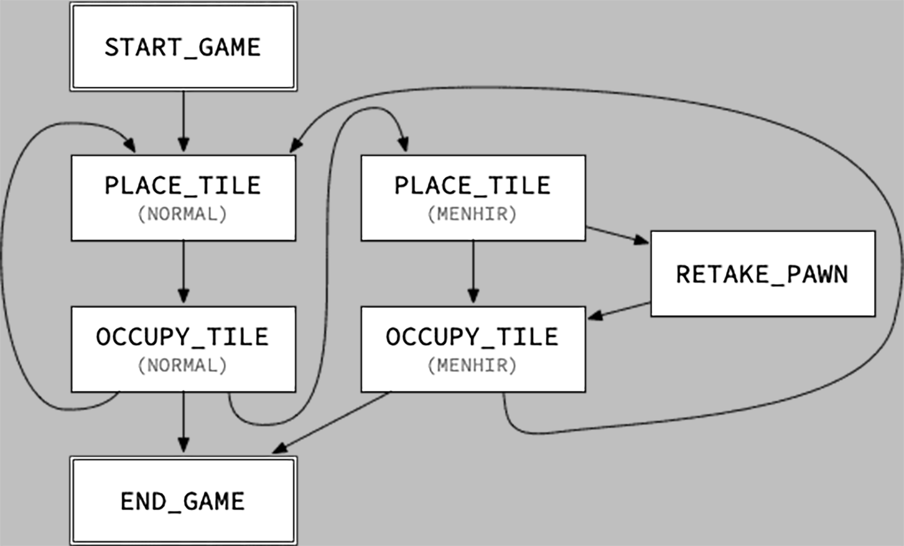
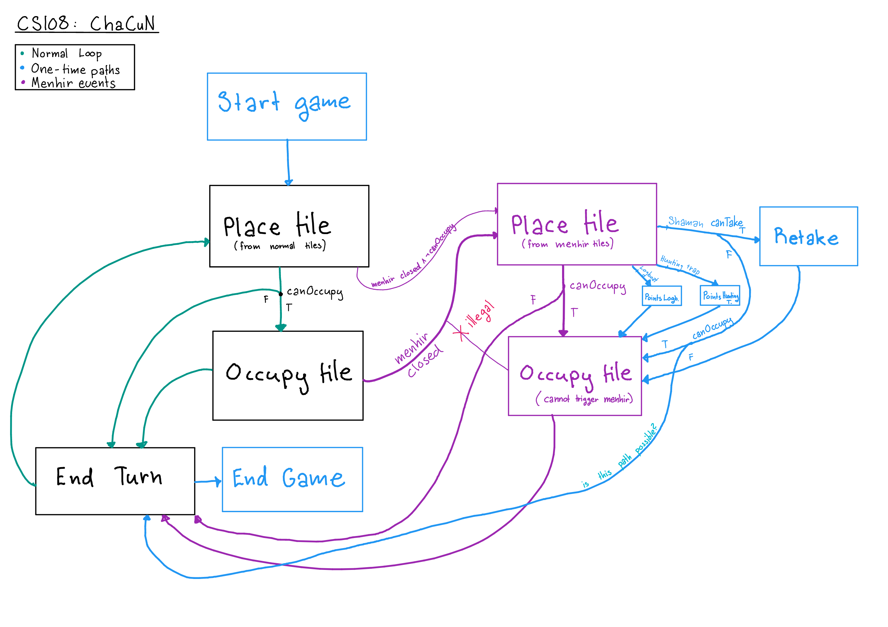
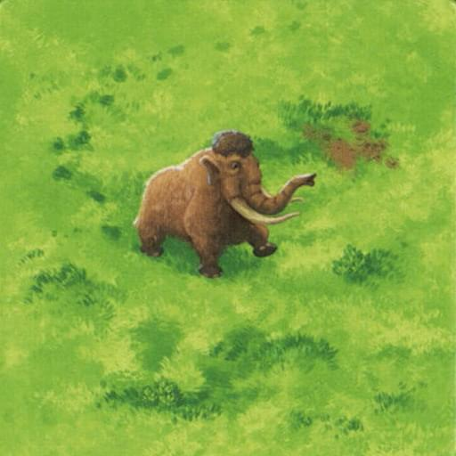

# CS-108 Project: ChaCuN
mmh yes overcomplication

## Important
### Translations
- `fosse à pieux` = `hunting trap`
- `grande fosse à pieux` = `pit trap`  

### Message generation
[messages.md](./cornucopia/messages.md)

idiot language

### State machine

## Links
- [Stage 3](https://cs108.epfl.ch/p/03_areas.html)
- [Stage 4](https://cs108.epfl.ch/p/04_partitions.html)
- [Stage 5](https://cs108.epfl.ch/p/05_board.html)
- [Stage 6](https://cs108.epfl.ch/p/06_state.html)

# Gamestate
------
 0. *START*
 1. *DRAW* from normal stack
 2. *PLACE* tile
  + Check for special effects
    + Menhir on forest closed triggers another *PLACE(Menhir)* (Only once)
    + Shaman triggers *RETAKEPAWN*
    + Logboat gives points
    + Hunting trap gives points
 3. *OCCUPY* occupant
 4. *END* if no more tiles placeable

## withPlacedTile
  + manages all transitions from *PLACETILE* 
    1. adding the given tile to the board 
    2. awarding any points obtained from placing the traps 
    3. determining the next action 
      + which may be *RETAKEPAWN* if the tile placed contains the shaman 
  + raises IllegalArgumentException if 
    + the next action is not *PLACETILE* 
    + the tile passed is already occupied

## withOccupantRemoved
  + handles all transitions starting from *RETAKEPAWN*
    1. deleting the given occupant unless it is _null_
      + this indicates that the player does not wish to take back a pawn 
  + raises IAE if 
    + the next action is not *RETAKEPAWN*
    + the given occupant is neither _null_ nor a pawn

## withNewOccupant
  + manages all transitions from *OCCUPYTILE*
    1. adding the occupant given to the last tile placed 
       + unless it is _null_, indicating that the player does not wish to place an occupant; 
  + raises IAE if 
    + the next action is not *OCCUPYTILE*
