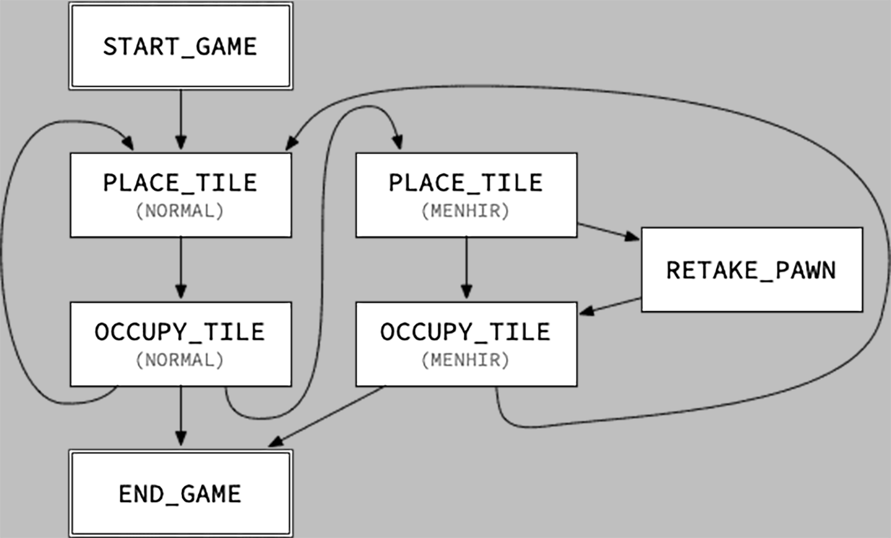

# CS-108 Project: ChaCuN
mmh yes overcomplication

## Important
### Translations
- `fosse à pieux` = `hunting trap`
- `grande fosse à pieux` = `pit trap`  

idiot language

### State machine

## Links
- [Stage 3](https://cs108.epfl.ch/p/03_areas.html)
- [Stage 4](https://cs108.epfl.ch/p/04_partitions.html)
- [Stage 5](https://cs108.epfl.ch/p/05_board.html)
- [Stage 6](https://cs108.epfl.ch/p/06_state.html)

